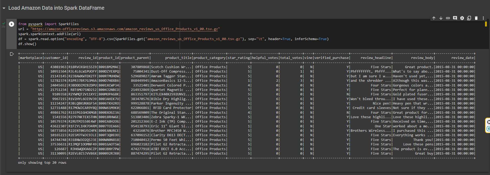
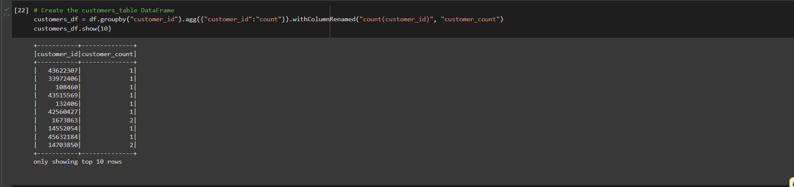
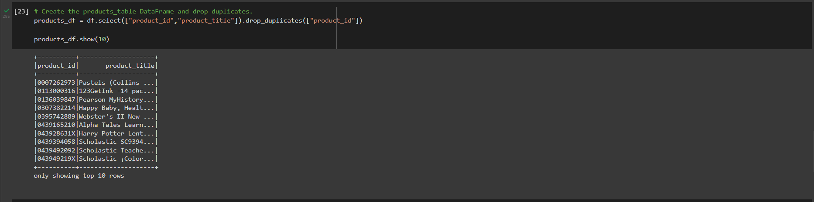
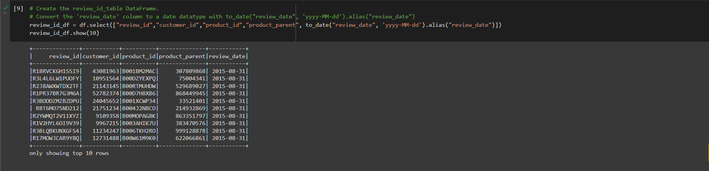
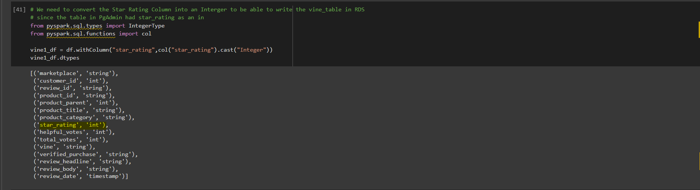
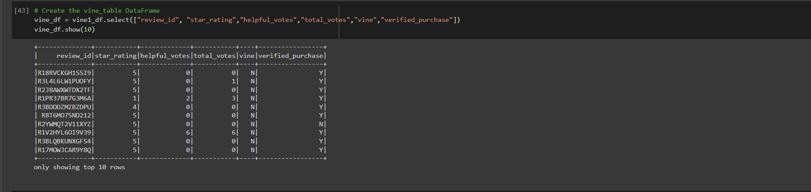
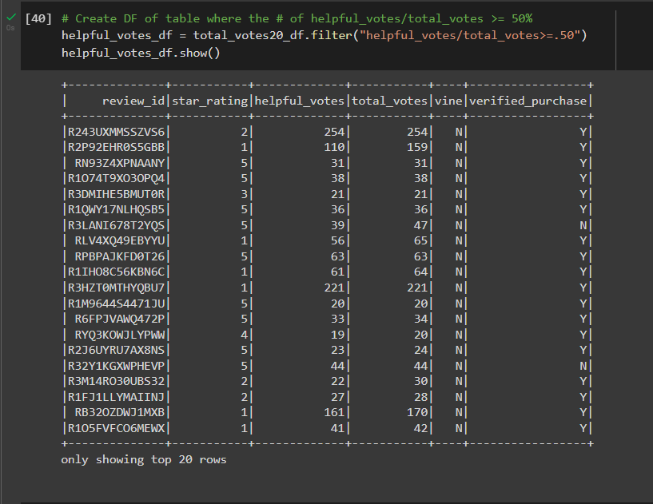
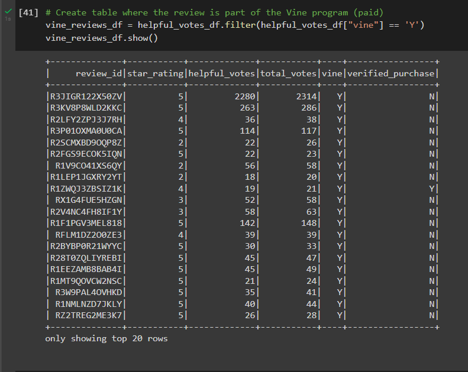

# Amazon_Vine_Analysis

## Overview of the analysis of the Vine program:

#### Since our work with Jennifer on the SellBy project was so successful, we were tasked to analyze more Amazon reviews written by members of the paid Amazon Vine program. The Amazon Vine program is a service that allows manufacturers and publishers to receive reviews for their products. Companies like SellBy pay a small fee to Amazon and provide products to Amazon Vine members, who are then required to publish a review.
#### In order for our analysis to be accurate, we were given access to approximately 50 datasets, each one contains reviews of a specific product. Our objective was to pick one of these datasets and use PySpark to perform the ETL process to extract the dataset, transform the data, connect to an AWS RDS instance, and load the transformed data into pgAdmin. 

#### Next, using PySpark, we helped determine if there is any bias toward favorable reviews from Vine members in the chosen dataset.

## Results:

* A link to download our dataset could be found below:
* [Office Products Reviews Link](https://amazon-officereviews.s3.amazonaws.com/amazon_reviews_us_Office_Products_v1_00.tsv.gz)

#### Below are few tables we created initially, we then loaded these tables and merged them into our PgAdmin.

* First access the entire data:

* Select a Customers table:

* Select a Products table:

* Select a Review ID table:

#### We ran into an issue loading the Vine dataframe into its matching table in pgAdmin. To resolve the problem, we casted/converted the star_rating column into an integer and that solved it.

* Select a Vine table

#### Once we had access to the Vine table, we proceeded with more focus into that specific dataframe since it contained most of the information we were interested in.

#### Over the next steps of the project, we analyzed the vine table a little more. We determined the total number of reviews, the number of 5-star reviews, and the percentage of 5-star reviews for the two types of review (paid vs unpaid), below are screenshots of our findings.

* We retrieved all the rows where the total votes count is equal to or greater than 20, this was done in order to pick reviews that are more likely to be helpful and to avoid having division by zero errors later on.

* Next we retrieved only the "Helpful" reviews.

* We also created a new table that retrieved all the rows where a review was written as part of the Vine program, and another table for the Unpaid reviews, the ones that are not part of the Vine program.

#### At last, our analysis helped us answer the below questions.

* How many Vine reviews and non-Vine reviews were there?
    * Based on our calculations, there was 969 Vine Reviews, and 43,745 non-Vine reviews.

* How many Vine reviews were 5 stars? How many non-Vine reviews were 5 stars?
    * The Vine 5-star reviews had a total of 430 reviews, while 19,233 were 5-star reviews from the non-Vine program.

* What percentage of Vine reviews were 5 stars? What percentage of non-Vine reviews were 5 stars?
    * 

